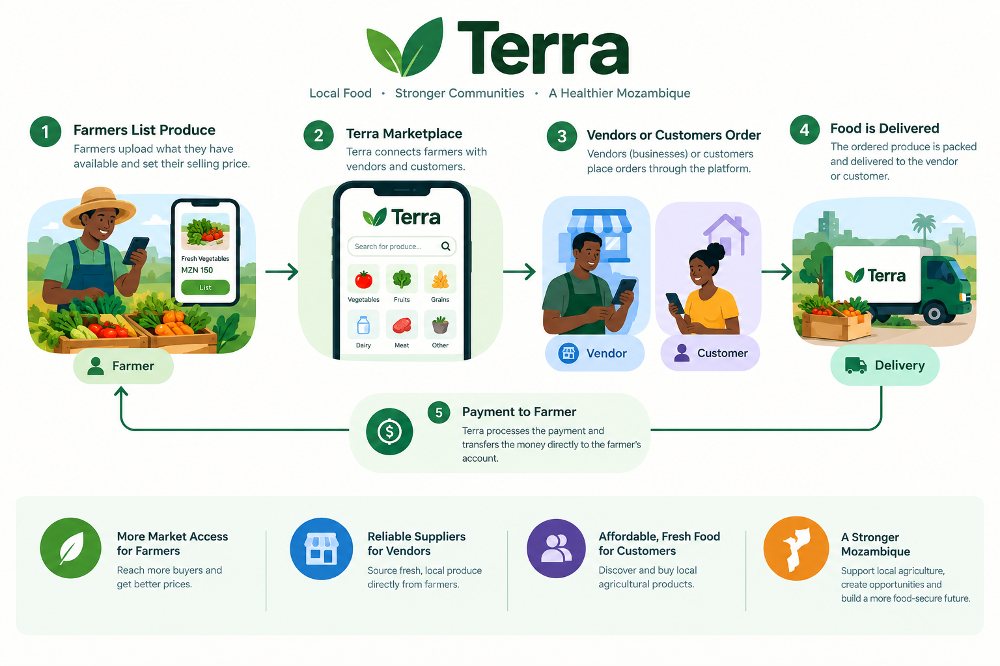
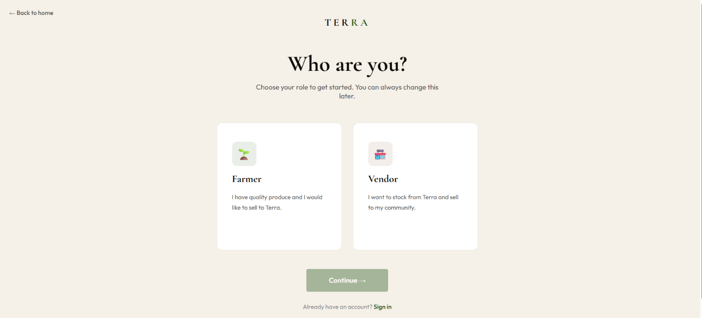

# Terra 🌱:  A farming app for Mozambique



# Table of contents 

- [Objective](#objective)
- [Data Source](#data-source)
- [Stages](#stages)
- [Market validation](#market-validation)
- [Design](#design)
  - [Mockup](#mockup)
  - [Tools](#tools)
- [Development](#development)
  - [Tech](#pseudocode)
  - [Data Exploration](#data-exploration)
  - [Data Cleaning](#data-cleaning)
  - [Transform the Data](#transform-the-data)
  - [Create the SQL View](#create-the-sql-view)
- [Testing](#testing)
  - [Data Quality Tests](#data-quality-tests)
- [Pilot Launch](#pilot-launch)
- [Terra AI](#terra-ai)
  - [Findings](#findings)
  - [Validation](#validation)
  - [Discovery](#discovery)
- [Conclusion](#conclusion)


# Objective 

- What is the key pain problem? 

Mozambique has smallholder farmers producing food, and vendors in Maputo who need it, but the two rarely connect efficiently.

- **Farmers** lack reliable access to urban markets. Distance, transport and payment risk make it hard to sell beyond their local area.
- **Vendors** struggle with inconsistent supply and quality, and many depend on produce imported from South Africa even when local farmers
  could supply it.
- **Trust** is the gap in between. Neither side can easily verify the other, and payment disputes are a risk for both.
- **Food insecurity** the country faces severe food insecurity because farmers grow at small scale and the food is not distributed evenly across provinces.
- **Inconsistent food prices** because food is imported across the borders, food prices tend to be unreliable because of currency fluctuation and political issues.


- What is the ideal solution? 

Terra is an aggregator, not a marketplace. We buy directly from verified smallholder farmers and resell to vendors in Maputo or households. Local ground agents
coordinate on the ground, farmers are paid before trucks move, and vendors pay upfront, which removes the trust problem for both sides. Farmers sell at a price they are comfortable in and then Terra list those produce to vendors or households.

In this way, food wastage will reduce as farmers will have a market to sell to and be confident enough to scale their produce.


## User stories

### Farmer
- As a smallholder farmer, I want to list my produce and available quantity so that buyers in Maputo can find me.
- As a farmer, I want to be paid before the truck leaves so that I don't carry the risk of non-payment.
- I want to find a reliable markert so that my produce doesn't spoil.
- I want to have a buyer who is going to buy at a fair price and someone who won't take advantage of me.

### Vendor
- As a vendor in Maputo, I want to order potatoes and onions from local, verified farmers so that I get steady supply without relying
  on imports.
- As a vendor, I want to see what's available and at what price so that I can plan my stock.
- I want to make sure that I always have stock because I have a lot of customers.
- The qulity of produce is very important to me.
- I want fast deliveries.


# Data source 

## Market Research

Terra's design is based on early market validation in Mozambique:

- Direct outreach to farmers and vendors via Facebook and TikTok
- Market intelligence from vendor networks in Zimpeto, Maputo
- Research into Mozambique's reliance on South African produce imports
- Case studies of similar models, including Twiga Foods (Kenya)


# Stages

- Market validation
- Design
- Developement
- Testing
- Pilot Launch
- Terra AI 
 


## 1. Market Validation (in progress)

Terra is being validated with real farmers and vendors before any
launch. This section explains the problem, the evidence behind it,
what has been done so far, and what must happen before launch.

### 1.1 Why Mozambique needs this

**Agriculture matters, but farmers are cut off from markets.**
Agriculture contributes about 24% of GDP and 20% of exports, and the
sector is dominated by small family farms with little connection to
the market and limited technology (Ministry of Agriculture official,
reported by Jornal Notícias). Only about 3% of the roughly 3.9 million
farms use fertiliser. Smallholders form the majority of the sector,
yet cultivated land per household has declined and access to inputs
remains limited and uneven across regions (UNU-WIDER, Agricultural
Development in Mozambique 2002–2020).

**Mozambique imports vegetables it could grow.**
South Africa exported about US$58.6M of edible vegetables to
Mozambique in 2025 (UN COMTRADE via Trading Economics).

| Product | 2025 value | 2024 value |
|---|---|---|
| Potatoes (fresh) | $25.59M | $20.24M |
| Onions, shallots, garlic, leeks | $20.63M | $19.19M |
| Tomatoes | $2.08M | $1.96M |
| Total vegetables and tubers | $58.57M | $46.82M |

Potatoes and onions together are about 79% of the 2025 total and 84%
of the 2024 total. These are the two launch products for Terra.
Note: the 2025 figures are South African export records and the 2024
figures are Mozambican import records. Both are formal customs data
only, so informal cross-border trade is not counted.

**The government wants to replace these imports.**
Mozambique's Agriculture Minister, Roberto Albino, has identified
Gaza province as capable of producing large volumes of potatoes,
tomatoes, cabbage and onions currently sourced from South Africa, and
called on producers, seed companies and stakeholders to work toward
replacing them (FreshPlaza). This supports Gaza as Terra's first
supply region.

**Food insecurity remains high.**
About 3.5 million people in Mozambique face acute food insecurity
(OCHA, reported by Lusa, 1 Sept 2026). Drivers include irregular
rainfall, repeated cyclones, conflict in the north and high food
prices (IPC, January 2026). Most severe needs are concentrated in
Cabo Delgado and Nampula.

**Scope.** Terra does not target humanitarian food aid. It addresses
market access for smallholders and import dependence for urban
vendors in Maputo. Lower local prices and more reliable local supply
are an indirect benefit.

### 1.2 The gap Terra fills

- Farmers have produce but no reliable route, buyer verification or
  payment certainty for reaching Maputo.
- Vendors need steady supply and rely on imports for potatoes and
  onions even though local production is possible.
- No trusted intermediary connects the two. Terra buys from verified
  farmers and resells to vendors, with ground agents coordinating.

### 1.3 Comparable models

- **Twiga Foods (Kenya):** aggregates produce from smallholders and
  supplies urban vendors. Terra follows the same aggregator logic.
- **Dangote's trajectory:** studied for how a business can scale by
  controlling supply and distribution in an African market.

### 1.4 Fieldwork completed

- Outreach to farmers and vendors via Facebook and TikTok
- Portuguese-language outreach messages for local contacts
- Joined a WhatsApp broadcast group run by a Zimpeto-based importer
  who sources from South Africa, for pricing and supply intelligence
- Mapped supply regions: Gaza (preferred first route, about 200 km
  from Maputo via the EN1), Boane (about 30 km from Maputo), Niassa
  and Manica
- Selected launch products (potatoes and onions) based on market
  demand, transport durability and confirmed supply

### 1.5 Operating model validated so far

- Terra buys directly from verified farmers and resells to vendors in
  Maputo. It is an aggregator, not a peer-to-peer marketplace.
- Farmers are paid before trucks move. Vendors pay upfront.
- Local ground agents coordinate farmer contact and pickups.

### 1.6 Exit criteria (no launch until met)

- [ ] At least 5 farmers confirmed (current: _/5)
- [ ] At least 5 vendors confirmed (current: _/5)
- [ ] Price per kg confirmed with farmers: _ MZN
- [ ] Price per kg vendors currently pay: _ MZN
- [ ] Transport cost per trip from Gaza to Maputo: _ MZN

### 1.7 Key findings so far

_Add real findings from conversations here, for example what farmers
said about current buyers or what vendors said about import prices._

### 1.8 Risks and open questions

- Weather and climate shocks (floods, drought, cyclones) can disrupt
  supply from Gaza.
- Transport reliability and cost on the EN1.
- Whether vendors will switch from established importers on price and
  quality.
- Seasonality of potato and onion supply.

### 1.9 Sources

1. Trading Economics / UN COMTRADE, South Africa exports of edible
   vegetables to Mozambique (2025):
   https://tradingeconomics.com/south-africa/exports/mozambique/edible-vegetables-certain-roots-tubers
2. Trading Economics / UN COMTRADE, Mozambique imports from South
   Africa (2024):
   https://tradingeconomics.com/mozambique/imports/south-africa/edible-vegetables-certain-roots-tubers
3. FreshPlaza, "Mozambique aims to reduce South African vegetable
   imports": https://www.freshplaza.com/africa/article/9857418/mozambique-aims-to-reduce-south-african-vegetable-imports/
4. UNU-WIDER, Agricultural Development in Mozambique 2002–2020:
   https://igmozambique.wider.unu.edu/opinion/factsheet
5. Forum Macao / Jornal Notícias, Ministry of Agriculture statistics:
   https://forumchinaplp.org.mo/en/economic_trade/view/344
6. IPC Mozambique Acute Food Insecurity Snapshot, Oct 2025 – Mar 2026:
   https://www.foodsecurityportal.org/sites/default/files/2026-01/IPC_Mozambique_Acute_Food_Insecurity_Oct2025_Mar2026_Snapshot.pdf
7. Lusa, 1 Sept 2026, OCHA figures on food insecurity:
   https://aman-alliance.org/Home/ContentDetail/106306

## 2. Design

The design stage defines who uses Terra, how they move through it,
and how it looks. Terra is built for people who may have limited
data, older phones and little time, so the design aims to be simple,
fast and clear. 

- What should the app contain, what features are needed to solve the actual problem? ( Farmers)
Terra connects farmers to vendors from across the country. So farmers need to be able to list their produce on the app and set the price at which they are going to sell the stock.
- Farmers need an easy form of money transfer method. Because most farmers are from rural areas, the most common and easy form of receiving and sending money is M-Pesa.
- Farmers need to have a collection point. Terra will arrange a collection point for all local framers willing to sell their produce. Terra will then collected the produce to its storage facilities.
- Farmers will immediately receive their payment after Terra has confirmed their produce quality.

- What should the app contain, what features are needed to solve the actual problem? (Vendors)
- Vendors should be able to order food or stock from Terra, while Terra delivers directly to their doorsteps.
- Terra will stock up lots of food to ensure that food is still available during unfavorable weather conditions.
- Terra delivers in less than 24 hours.
- The app should enable vendors to enter their addresses and payment details.

  

### 2.1 Design principles

- **Simple first.** Few steps, large buttons, minimal typing.
- **Mobile first.** Most farmers and vendors will use Terra on a phone.
- **Low data.** Light pages and few images so it loads on slow
  connections.
- **Trust.** Clear order status and payment steps, because trust is
  the main gap Terra fills.
- **Portuguese first.** The interface will be in Portuguese, with
  English as a secondary language.

### 2.2 Users and roles

| Role | Goal | Key screens |
|---|---|---|
| Farmer | List produce, get paid before pickup | Register, add produce, orders, payments |
| Vendor | Order reliable local produce | Browse produce, place order, order status |
| Admin | Verify users, manage orders and pickups | Verification, orders, ground agents |

### 2.3 User flows

**Farmer:** Register -> Admin verifies -> List produce and quantity
-> Order matched -> Paid before truck moves -> Produce collected by
ground agent

**Vendor:** Register -> Browse available produce -> Place order and
pay upfront -> Track order -> Receive delivery in Maputo

**Admin:** Review new farmers and vendors -> Approve or reject ->
Monitor orders -> Assign pickups -> Resolve issues

### 2.4 Visual identity

- **Colors:** Green `#2A5C22` for the primary brand color and cream
  `#F5F0E8` for backgrounds. Green connects to farming and growth.
  Cream keeps the design warm and readable.
- **Typography:** Cormorant Garamond for headings and Outfit for body
  text and buttons.
- **Tone:** Warm, trustworthy and local.

### 2.5 Design deliverables

- [ ] User flows for the three roles
- [ ] Wireframes for key screens
- [ ] Color palette and typography defined
- [ ] High-fidelity mockups (Figma)
- [ ] Mobile responsive layouts
- [ ] Portuguese copy for all screens

### 2.6 Design decisions

- **Aggregator, not marketplace:** farmers do not sell directly to
  vendors, so the screens are simpler. Farmers list produce and
  vendors order from Terra.
- **Payment before movement:** order status screens show payment
  clearly, so both sides trust the process.
- **Role-based access:** each role sees only its own tools.

### 2.7 Terra AI (planned)

An LLM-powered feature that recommends produce to vendors based on
market trends. It will appear as a simple suggestions panel on the
vendor dashboard, not a chat window.

### 2.8 App feautures


#### Core platform
- [x] Role-based accounts: farmer, vendor and admin
- [x] Authentication (register and log in) with protected routes
- [x] Aggregator model: Terra buys from verified farmers and resells
      to vendors
- [x] Produce marketplace view
- [ ] Portuguese and English interface
- [ ] Mobile-responsive layout for low-end phones and slow connections

#### Farmer features
- [ ] Register and submit details for verification
- [ ] List produce with type, quantity and expected availability date
- [ ] Update or remove listings
- [ ] View order status for their produce
- [ ] Payment confirmation before pickup (farmers are paid before
      trucks move)
- [ ] Pickup schedule with the assigned ground agent
- [ ] Order and payment history

#### Vendor features
- [ ] Register and submit details for verification
- [ ] Browse available produce (launch products: potatoes and onions)
- [ ] See price and available quantity
- [ ] Place an order
- [ ] Pay upfront before the order is confirmed
- [ ] Track order status from confirmation to delivery in Maputo
- [ ] Order history and reorder

#### Admin features
- [ ] Verify or reject farmer and vendor accounts
- [ ] View and manage all listings and orders
- [ ] Set and update prices
- [ ] Assign ground agents to pickups
- [ ] Track payments (farmers paid, vendors paid)
- [ ] Monitor deliveries from farm to Maputo
- [ ] Basic reports: volumes, prices, orders per region

#### Ground agent coordination
- [ ] Local coordinators in supply regions (Gaza, Boane, Niassa, Manica)
- [ ] Pickup confirmation and quantity check
- [ ] Quality check notes at collection

#### Trust and payments
- [ ] Verified-user badges
- [ ] Clear payment status on every order
- [ ] Notifications (SMS or WhatsApp) for order updates

#### Terra AI (planned)
- [ ] LLM-powered produce recommendations for vendors
- [ ] Short summaries of market trends and prices
- [ ] Suggestions shown on the vendor dashboard

#### Planned later
- [ ] More products beyond potatoes and onions
- [ ] More supply regions
- [ ] Mobile money payments integration
- [ ] Offline-friendly mode for areas with poor connectivity

## 3. Development

Terra is a full-stack web application. The frontend, backend and database are built separately and communicate through a REST API.

### 3.1 Tech stack

| Layer | Technology |
|---|---|
| Frontend | React |
| Backend | Node.js, Express |
| Database | MongoDB (MongoDB Atlas) |
| Authentication | Token-based auth with role-based access |
| Styling | Custom design system (green and cream palette, Cormorant Garamond and Outfit fonts) |
| Version control | Git and GitHub |
| Terra AI (planned) | LLM API |

### 3.2 Architecture


- The frontend renders a different experience for each role.
- The backend handles authentication, authorization and business
  logic.
- Controllers keep route handlers thin and logic organized.
- MongoDB stores users, produce listings and orders.

### 3.3 Backend

- Express server with modular routes and controllers
- Authentication routes: register, log in, protected routes
- Role-based middleware for farmer, vendor and admin access
- Password hashing and token generation
- Environment-based configuration

### 3.4 Frontend

- React single-page application
- Role-specific dashboards and navigation
- Produce marketplace view
- Reusable components following the Terra design system
- Mobile-responsive layout

  
  

  

### 3.5 Database

Main collections:

- **Users:** name, contact, role, verification status
- **Produce:** farmer, product type, quantity, price, availability
- **Orders:** vendor, items, payment status, delivery status

### 3.6 Getting started

**Prerequisites**
- Node.js (v18 or later)
- A MongoDB Atlas account and cluster
- Git

**Installation**

```bash
git clone https://github.com/YIOPTOFF2001/<repo-name>.git
cd <repo-name>

# backend
cd server
npm install

# frontend
cd ../client
npm install
```

**Environment variables**

Create a `.env` file in the backend folder:

Never commit your `.env` file. Add it to `.gitignore`.

**Run the app**

```bash
# backend
cd server
npm run dev

# frontend (new terminal)
cd client
npm start
```

### 3.7 Troubleshooting

**MongoDB Atlas connection error (DNS)**
If the backend cannot connect to Atlas, the cause may be your
network's DNS settings failing to resolve the Atlas address. Try
switching your DNS to a public resolver such as Google (8.8.8.8) or
Cloudflare (1.1.1.1), or use the standard (non-SRV) connection string
from Atlas.

### 3.8 Development progress

- [x] Project setup (frontend and backend)
- [x] Authentication routes and controllers
- [x] Role-based access (farmer, vendor, admin)
- [x] Produce marketplace UI
- [ ] Produce listing management (farmers)
- [ ] Ordering flow (vendors)
- [ ] Admin verification and order management
- [ ] Payment status tracking
- [ ] Notifications
- [ ] Terra AI recommendation layer

### 3.9 Challenges and decisions

- **Aggregator model over marketplace:** simplifies trust and payment
  flows, so the data model is built around Terra as the middle party.
- **Atlas connection issue:** traced to DNS resolution on the local
  network and fixed by changing DNS settings.
- **Terra AI kept separate:** planned as an add-on layer so the core
  platform works without it.
