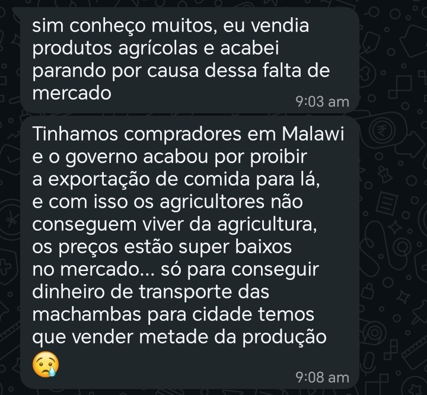

# Terra 🌱:  Connect farmers to vendors


# Table of contents 

- [Objective](#objective)
- [Data Source](#data-source)
- [Stages](#stages)
- [1. Market Validation](#1-market-validation-in-progress)
-  [2. Design](#2-design)
- [3. Development](#3-development)
- [4. Testing](#4-testing)
- [5. Pilot Launch](#5-pilot-launch) 
- [6. Review and scale](#6-review-and-scale)
- [7. Terra AI ](#7-terra-ai-planned)
- [Conclusion](#conclusion)


# Objective 

- What is the key pain problem? 

Mozambique has smallholder farmers producing food, and vendors in Maputo who need it, but the two rarely connect efficiently.

- **Farmers** lack reliable access to urban markets. Distance, transport and payment risk make it hard to sell beyond their local area.
- **Vendors** struggle with inconsistent supply and quality, and many depend on produce imported from South Africa even when local farmers
  could supply it.
- **Trust** is the gap in between. Neither side can easily verify the other, and payment disputes are a risk for both.
- **Food insecurity** the country faces severe food insecurity because farmers grow at small scale and the food is not distributed evenly across provinces.
- **Inconsistent food prices** because food is imported across the borders, food prices tend to be unreliable because of currency fluctuation and political issues.


- What is the ideal solution? 

Terra is an aggregator, not a marketplace. We buy directly from verified smallholder farmers and resell to vendors in Maputo or households. Local ground agents
coordinate on the ground, farmers are paid before trucks move, and vendors pay upfront, which removes the trust problem for both sides. Farmers sell at a price they are comfortable in and then Terra list those produce to vendors or households.

In this way, food wastage will reduce as farmers will have a market to sell to and be confident enough to scale their produce.


## User stories

### Farmer
- As a smallholder farmer, I want to list my produce and available quantity so that buyers in Maputo can find me.
- As a farmer, I want to be paid before the truck leaves so that I don't carry the risk of non-payment.
- I want to find a reliable markert so that my produce doesn't spoil.
- I want to have a buyer who is going to buy at a fair price and someone who won't take advantage of me.

### Vendor
- As a vendor in Maputo, I want to order potatoes and onions from local, verified farmers so that I get steady supply without relying
  on imports.
- As a vendor, I want to see what's available and at what price so that I can plan my stock.
- I want to make sure that I always have stock because I have a lot of customers.
- The qulity of produce is very important to me.
- I want fast deliveries.
- The cost of transporting food across borders has become more and more expensive. The conflict in Iran has contributed to Mozambique's rising cost of fuel making transportng food even more expensive.


# Data source 

## Market Research

Terra's design is based on early market validation in Mozambique:

- Direct outreach to farmers and vendors via Facebook and TikTok
- Market intelligence from vendor networks in Zimpeto, Maputo
- Research into Mozambique's reliance on South African produce imports
- Case studies of similar models, including Twiga Foods (Kenya)


# Stages

- Market validation
- Design
- Developement
- Testing
- Pilot Launch
- Terra AI 
 


## 1. Market Validation (in progress)

Terra is being validated with real farmers and vendors before any
launch. This section explains the problem, the evidence behind it,
what has been done so far, and what must happen before launch.

### 1.1 Why Mozambique needs this

**Agriculture matters, but farmers are cut off from markets.**
Agriculture contributes about 24% of GDP and 20% of exports, and the
sector is dominated by small family farms with little connection to
the market and limited technology (Ministry of Agriculture official,
reported by Jornal Notícias). Only about 3% of the roughly 3.9 million
farms use fertiliser. Smallholders form the majority of the sector,
yet cultivated land per household has declined and access to inputs
remains limited and uneven across regions (UNU-WIDER, Agricultural
Development in Mozambique 2002–2020).

**Mozambique imports vegetables it could grow.**
South Africa exported about US$58.6M of edible vegetables to
Mozambique in 2025 (UN COMTRADE via Trading Economics).

| Product | 2025 value | 2024 value |
|---|---|---|
| Potatoes (fresh) | $25.59M | $20.24M |
| Onions, shallots, garlic, leeks | $20.63M | $19.19M |
| Tomatoes | $2.08M | $1.96M |
| Total vegetables and tubers | $58.57M | $46.82M |

Potatoes and onions together are about 79% of the 2025 total and 84%
of the 2024 total. These are the two launch products for Terra.
Note: the 2025 figures are South African export records and the 2024
figures are Mozambican import records. Both are formal customs data
only, so informal cross-border trade is not counted.

**The government wants to replace these imports.**
Mozambique's Agriculture Minister, Roberto Albino, has identified
Gaza province as capable of producing large volumes of potatoes,
tomatoes, cabbage and onions currently sourced from South Africa, and
called on producers, seed companies and stakeholders to work toward
replacing them (FreshPlaza). This supports Gaza as Terra's first
supply region.

**Food insecurity remains high.**
About 3.5 million people in Mozambique face acute food insecurity
(OCHA, reported by Lusa, 1 Sept 2026). Drivers include irregular
rainfall, repeated cyclones, conflict in the north and high food
prices (IPC, January 2026). Most severe needs are concentrated in
Cabo Delgado and Nampula.

**Scope.** Terra does not target humanitarian food aid. It addresses
market access for smallholders and import dependence for urban
vendors in Maputo. Lower local prices and more reliable local supply
are an indirect benefit.

### 1.2 The gap Terra fills

- Farmers have produce but no reliable route, buyer verification or
  payment certainty for reaching Maputo.
- Vendors need steady supply and rely on imports for potatoes and
  onions even though local production is possible.
- No trusted intermediary connects the two. Terra buys from verified
  farmers and resells to vendors, with ground agents coordinating.

### 1.3 Comparable models

- **Twiga Foods (Kenya):** aggregates produce from smallholders and
  supplies urban vendors. Terra follows the same aggregator logic.
- **Dangote's trajectory:** studied for how a business can scale by
  controlling supply and distribution in an African market.

### 1.4 Fieldwork completed

- Outreach to farmers and vendors via Facebook and TikTok
- Portuguese-language outreach messages for local contacts
- Joined a WhatsApp broadcast group run by a Zimpeto-based importer
  who sources from South Africa, for pricing and supply intelligence
- Mapped supply regions: Gaza (preferred first route, about 200 km
  from Maputo via the EN1), Boane (about 30 km from Maputo), Niassa
  and Manica
- Selected launch products (potatoes and onions) based on market
  demand, transport durability and confirmed supply

### 1.5 Operating model validated so far

- Terra buys directly from verified farmers and resells to vendors in
  Maputo. It is an aggregator, not a peer-to-peer marketplace.
- Farmers are paid before trucks move. Vendors pay upfront.
- Local ground agents coordinate farmer contact and pickups.

### 1.6 Exit criteria (no launch until met)

- [x] At least 5 farmers confirmed (current: 6/5)
- [x] At least 5 vendors confirmed (current: 4/5)
- [ ] Price per kg confirmed with farmers: _ MZN 
- [ ] Price per kg vendors currently pay: _ MZN
- [ ] Transport cost per trip from Gaza to Maputo: _ MZN

NB: Farmers are currently selling at market price. 10 kg of potatoes ranges from 350 MZN.

### 1.7 Key findings so far

 


A sample conversation between myself and a farmer. He highlights that government has restricted the export of food to Malawi due to the country's food insecurity isses. He has lost reliable income because he can't find a new market.

### 1.8 Risks and open questions

- Weather and climate shocks (floods, drought, cyclones) can disrupt
  supply from Gaza.
- Transport reliability and cost on the EN1.
- Whether vendors will switch from established importers on price and
  quality.
- Seasonality of potato and onion supply.

### 1.9 Sources

1. Trading Economics / UN COMTRADE, South Africa exports of edible
   vegetables to Mozambique (2025):
   https://tradingeconomics.com/south-africa/exports/mozambique/edible-vegetables-certain-roots-tubers
2. Trading Economics / UN COMTRADE, Mozambique imports from South
   Africa (2024):
   https://tradingeconomics.com/mozambique/imports/south-africa/edible-vegetables-certain-roots-tubers
3. FreshPlaza, "Mozambique aims to reduce South African vegetable
   imports": https://www.freshplaza.com/africa/article/9857418/mozambique-aims-to-reduce-south-african-vegetable-imports/
4. UNU-WIDER, Agricultural Development in Mozambique 2002–2020:
   https://igmozambique.wider.unu.edu/opinion/factsheet
5. Forum Macao / Jornal Notícias, Ministry of Agriculture statistics:
   https://forumchinaplp.org.mo/en/economic_trade/view/344
6. IPC Mozambique Acute Food Insecurity Snapshot, Oct 2025 – Mar 2026:
   https://www.foodsecurityportal.org/sites/default/files/2026-01/IPC_Mozambique_Acute_Food_Insecurity_Oct2025_Mar2026_Snapshot.pdf
7. Lusa, 1 Sept 2026, OCHA figures on food insecurity:
   https://aman-alliance.org/Home/ContentDetail/106306

## 2. Design

The design stage defines who uses Terra, how they move through it,
and how it looks. Terra is built for people who may have limited
data, older phones and little time, so the design aims to be simple,
fast and clear. 

- What should the app contain, what features are needed to solve the actual problem? ( Farmers)
Terra connects farmers to vendors from across the country. So farmers need to be able to list their produce on the app and set the price at which they are going to sell the stock.
- Farmers need an easy form of money transfer method. Because most farmers are from rural areas, the most common and easy form of receiving and sending money is M-Pesa.
- Farmers need to have a collection point. Terra will arrange a collection point for all local framers willing to sell their produce. Terra will then collected the produce to its storage facilities.
- Farmers will immediately receive their payment after Terra has confirmed their produce quality.

- What should the app contain, what features are needed to solve the actual problem? (Vendors)
- Vendors should be able to order food or stock from Terra, while Terra delivers directly to their doorsteps.
- Terra will stock up lots of food to ensure that food is still available during unfavorable weather conditions.
- Terra delivers in less than 24 hours.
- The app should enable vendors to enter their addresses and payment details.

  

### 2.1 Design principles

- **Simple first.** Few steps, large buttons, minimal typing.
- **Mobile first.** Most farmers and vendors will use Terra on a phone.
- **Low data.** Light pages and few images so it loads on slow
  connections.
- **Trust.** Clear order status and payment steps, because trust is
  the main gap Terra fills.
- **Portuguese first.** The interface will be in Portuguese, with
  English as a secondary language.

### 2.2 Users and roles

| Role | Goal | Key screens |
|---|---|---|
| Farmer | List produce, get paid before pickup | Register, add produce, orders, payments |
| Vendor | Order reliable local produce | Browse produce, place order, order status |
| Admin | Verify users, manage orders and pickups | Verification, orders, ground agents |

### 2.3 User flows

**Farmer:** Register -> Admin verifies -> List produce and quantity
-> Order matched -> Paid before truck moves -> Produce collected by
ground agent

**Vendor:** Register -> Browse available produce -> Place order and
pay upfront -> Track order -> Receive delivery in Maputo

**Admin:** Review new farmers and vendors -> Approve or reject ->
Monitor orders -> Assign pickups -> Resolve issues

### 2.4 Visual identity

- **Colors:** Green `#2A5C22` for the primary brand color and cream
  `#F5F0E8` for backgrounds. Green connects to farming and growth.
  Cream keeps the design warm and readable.
- **Typography:** Cormorant Garamond for headings and Outfit for body
  text and buttons.
- **Tone:** Warm, trustworthy and local.

### 2.5 Design deliverables

- [ ] User flows for the three roles
- [ ] Wireframes for key screens
- [ ] Color palette and typography defined
- [ ] High-fidelity mockups (Figma)
- [ ] Mobile responsive layouts
- [ ] Portuguese copy for all screens

### 2.6 Design decisions

- **Aggregator, not marketplace:** farmers do not sell directly to
  vendors, so the screens are simpler. Farmers list produce and
  vendors order from Terra.
- **Payment before movement:** order status screens show payment
  clearly, so both sides trust the process.
- **Role-based access:** each role sees only its own tools.

### 2.7 Terra AI (planned)

An LLM-powered feature that recommends produce to vendors based on
market trends. It will appear as a simple suggestions panel on the
vendor dashboard, not a chat window.

### 2.8 App feautures


#### Core platform
- [x] Role-based accounts: farmer, vendor and admin
- [x] Authentication (register and log in) with protected routes
- [x] Aggregator model: Terra buys from verified farmers and resells
      to vendors
- [x] Produce marketplace view
- [ ] Portuguese and English interface
- [ ] Mobile-responsive layout for low-end phones and slow connections

#### Farmer features
- [ ] Register and submit details for verification
- [ ] List produce with type, quantity and expected availability date
- [ ] Update or remove listings
- [ ] View order status for their produce
- [ ] Payment confirmation before pickup (farmers are paid before
      trucks move)
- [ ] Pickup schedule with the assigned ground agent
- [ ] Order and payment history

#### Vendor features
- [ ] Register and submit details for verification
- [ ] Browse available produce (launch products: potatoes and onions)
- [ ] See price and available quantity
- [ ] Place an order
- [ ] Pay upfront before the order is confirmed
- [ ] Track order status from confirmation to delivery in Maputo
- [ ] Order history and reorder

#### Admin features
- [ ] Verify or reject farmer and vendor accounts
- [ ] View and manage all listings and orders
- [ ] Set and update prices
- [ ] Assign ground agents to pickups
- [ ] Track payments (farmers paid, vendors paid)
- [ ] Monitor deliveries from farm to Maputo
- [ ] Basic reports: volumes, prices, orders per region

#### Ground agent coordination
- [ ] Local coordinators in supply regions (Gaza, Boane, Niassa, Manica)
- [ ] Pickup confirmation and quantity check
- [ ] Quality check notes at collection

#### Trust and payments
- [ ] Verified-user badges
- [ ] Clear payment status on every order
- [ ] Notifications (SMS or WhatsApp) for order updates

#### Terra AI (planned)
- [ ] LLM-powered produce recommendations for vendors
- [ ] Short summaries of market trends and prices
- [ ] Suggestions shown on the vendor dashboard

#### Planned later
- [ ] More products beyond potatoes and onions
- [ ] More supply regions
- [ ] Mobile money payments integration
- [ ] Offline-friendly mode for areas with poor connectivity

## 3. Development

Terra is a full-stack web application. The frontend, backend and database are built separately and communicate through a REST API.

### 3.1 Tech stack

| Layer | Technology |
|---|---|
| Frontend | React |
| Backend | Node.js, Express |
| Database | MongoDB (MongoDB Atlas) |
| Authentication | Token-based auth with role-based access |
| Styling | Custom design system (green and cream palette, Cormorant Garamond and Outfit fonts) |
| Version control | Git and GitHub |
| Terra AI (planned) | LLM API |

### 3.2 Architecture


- The frontend renders a different experience for each role.
- The backend handles authentication, authorization and business
  logic.
- Controllers keep route handlers thin and logic organized.
- MongoDB stores users, produce listings and orders.

### 3.3 Backend

- Express server with modular routes and controllers
- Authentication routes: register, log in, protected routes
- Role-based middleware for farmer, vendor and admin access
- Password hashing and token generation
- Environment-based configuration

### 3.4 Frontend

- React single-page application
- Role-specific dashboards and navigation
- Produce marketplace view
- Reusable components following the Terra design system
- Mobile-responsive layout

  
  

  

### 3.5 Database

Main collections:

- **Users:** name, contact, role, verification status
- **Produce:** farmer, product type, quantity, price, availability
- **Orders:** vendor, items, payment status, delivery status

### 3.6 Getting started

**Prerequisites**
- Node.js (v18 or later)
- A MongoDB Atlas account and cluster
- Git

**Installation**

```bash
git clone https://github.com/YIOPTOFF2001/<Terra>.git
cd <Terra>

# backend
cd server
npm install

# frontend
cd ../client
npm install
```

**Environment variables**

Create a `.env` file in the backend folder:

Never commit your `.env` file. Add it to `.gitignore`.

**Run the app**

```bash
# backend
cd server
npm run dev

# frontend (new terminal)
cd client
npm start
```

### 3.7 Troubleshooting

**MongoDB Atlas connection error (DNS)**
If the backend cannot connect to Atlas, the cause may be your
network's DNS settings failing to resolve the Atlas address. Try
switching your DNS to a public resolver such as Google (8.8.8.8) or
Cloudflare (1.1.1.1), or use the standard (non-SRV) connection string
from Atlas.

### 3.8 Development progress

- [x] Project setup (frontend and backend)
- [x] Authentication routes and controllers
- [x] Role-based access (farmer, vendor, admin)
- [x] Produce marketplace UI
- [x] Produce listing management (farmers)
- [x] Ordering flow (vendors)
- [x] Admin verification and order management
- [x] Payment status tracking
- [x] Notifications
- [x] Terra AI recommendation layer

### 3.9 Challenges and decisions

- **Aggregator model over marketplace:** simplifies trust and payment
  flows, so the data model is built around Terra as the middle party.
- **Atlas connection issue:** traced to DNS resolution on the local
  network and fixed by changing DNS settings.
- **Terra AI kept separate:** planned as an add-on layer so the core
  platform works without it.

## 4. Testing

Testing makes sure Terra works for the people who will rely on it:
farmers, vendors and admins. Because Terra handles orders and
payments between people who need to trust each other, the focus is
on correctness, security and ease of use on basic phones.

### 4.1 Testing approach

- **Functional testing:** every feature works for each role.
- **API testing:** backend routes return the right responses and
  errors.
- **Security testing:** users can only access what their role allows.
- **Usability testing:** real farmers and vendors try the app.
- **Compatibility testing:** works on common browsers and low-end
  phones.

### 4.2 Functional testing

**Authentication**
- [ ] Register with valid details
- [ ] Register with a duplicate email or phone number is rejected
- [ ] Log in with correct credentials
- [ ] Log in with wrong credentials shows a clear error
- [ ] Logged-out users cannot open protected pages

**Farmer**
- [ ] Add, edit and remove a produce listing
- [ ] View orders for their produce
- [ ] Payment status displays correctly

**Vendor**
- [ ] Browse available produce
- [ ] Place an order
- [ ] Track order status
- [ ] Order history displays correctly

**Admin**
- [ ] Verify and reject accounts
- [ ] View and manage all orders
- [ ] Assign pickups

### 4.3 Role-based access testing

- [ ] A farmer cannot open vendor or admin pages
- [ ] A vendor cannot open farmer or admin pages
- [ ] Only admins can verify users or change prices
- [ ] Expired or invalid tokens are rejected

### 4.4 API testing

Backend routes tested with Postman (or a similar tool):

| Route | Method | Expected result | Status |
|---|---|---|---|
| /api/auth/register | POST | User created | [ ] |
| /api/auth/login | POST | Token returned | [ ] |
| _add your routes_ | | | |

### 4.5 Usability testing with real users

Terra will be tested with the first farmers and vendors during the
pilot, before the full launch.

- [ ] Can a farmer list produce without help?
- [ ] Can a vendor place an order without help?
- [ ] Is the Portuguese text clear to them?
- [ ] Does the app load acceptably on their phones and data?

**Feedback received:** _add real quotes and findings here_

### 4.6 Compatibility testing

- [ ] Chrome (desktop and mobile)
- [ ] Firefox
- [ ] Safari or iOS
- [ ] Low-end Android phone
- [ ] Slow connection (throttled in browser dev tools)

### 4.7 Bugs found and fixed

| Bug | Cause | Fix | Status |
|---|---|---|---|
| MongoDB Atlas connection error | DNS resolution on local network | Changed DNS settings | Fixed |
| _add more_ | | | |

### 4.8 Results summary

- Tests passed: _/_
- Critical bugs open: _
- Ready for pilot launch: yes / no

  ## 5. Pilot Launch

The pilot is Terra's first real-world run. It tests the full chain
from farm to vendor at small scale before expanding. Nothing launches
until the exit criteria in Section 1.6 are met.

### 5.1 Pilot goals

- Prove that Terra can buy from verified smallholders and deliver to
  vendors in Maputo reliably
- Confirm that the payment model works: farmers paid before trucks
  move, vendors paying upfront
- Learn real costs: farmer price, transport, margin
- Collect feedback from the first farmers and vendors
- Find operational problems before scaling

### 5.2 Pilot scope

| Item | Pilot setting |
|---|---|
| Products | Potatoes and onions |
| Supply region | Gaza province (first route, about 200 km from Maputo via the EN1) |
| Delivery market | Maputo |
| Farmers | At least 5 verified |
| Vendors | At least 5 confirmed |
| Duration | _ weeks |
| Start date | _ |

### 5.3 Pilot prerequisites (go / no-go checklist)

- [ ] 5 farmers confirmed
- [ ] 5 vendors confirmed
- [ ] Ground agent in place in Gaza
- [ ] Transport arranged and costed
- [ ] Farmer and vendor prices agreed
- [ ] Payment method set up for farmers and vendors
- [ ] App tested on the real users' phones
- [ ] Backend deployed and accessible online

### 5.4 How a pilot order works

1. Vendor places an order and pays upfront
2. Terra confirms the order with the farmer
3. Ground agent checks quantity and quality at the farm
4. Terra pays the farmer before the truck moves
5. Produce is transported from Gaza to Maputo
6. Vendor receives the delivery and confirms it
7. Order is recorded as complete

### 5.5 Pilot roles

| Who | Responsibility |
|---|---|
| Terra (founder) | Order management, vendor relations, payments |
| Ground agent | Farmer contact, quality check, pickup coordination |
| Farmers | Supply agreed produce |
| Vendors | Order and pay upfront, confirm delivery |
| Transport partner | Move produce Gaza to Maputo |

### 5.6 Metrics to track

| Metric | Why it matters | Result |
|---|---|---|
| Number of orders completed | Shows demand | _ |
| Total volume delivered (kg) | Shows scale | _ |
| Farmer price per kg | Farmer income | _ |
| Vendor price per kg | Compare to imports | _ |
| Transport cost per kg | Business viability | _ |
| Produce lost or rejected (%) | Quality and logistics | _ |
| On-time deliveries (%) | Reliability | _ |
| Repeat vendor orders | Vendor satisfaction | _ |
| Farmer and vendor feedback | Product fit | _ |

### 5.7 Risks and plans

| Risk | Plan |
|---|---|
| Spoilage during transport | Choose durable products; limit trip length; check quality at pickup |
| Weather or road delays | Buffer time; confirm delivery windows with vendors |
| Vendors prefer existing importers | Compete on freshness, reliability and price; collect feedback |
| Payment disputes | Clear order records in the app; pay farmers before trucks move |
| Low farmer supply | Keep backup farmers in Boane and other regions |

### 5.8 After the pilot

- Review the metrics against the goals
- Decide: adjust, repeat or scale
- Share lessons learned in Section 6

## 6. Review and Scale

After the pilot, Terra reviews what actually happened and decides
what to do next. Growth is based on evidence from real orders, not
assumptions.

### 6.1 Review process

1. Collect all pilot data (orders, volumes, prices, costs, losses)
2. Compare the results with the pilot goals in Section 5.1
3. Gather feedback from farmers, vendors and the ground agent
4. List what worked, what failed and why
5. Decide: fix, repeat or scale

### 6.2 Questions the review must answer

- Does Terra make money per kg after transport and losses?
- Are vendors willing to buy from Terra again, and at what price?
- Do farmers get a better deal than their current options?
- Was produce delivered fresh and on time?
- Did the payment model (farmers paid first, vendors pay upfront)
  work without disputes?
- Where did the process break down?

### 6.3 Decision criteria

| Result | Decision |
|---|---|
| Profitable, vendors reorder, low losses | Scale to more farmers, vendors and volume |
| Demand is good, but costs or losses are too high | Fix logistics, then repeat the pilot |
| Vendors will not switch from importers | Revisit pricing, quality and the target vendors |
| Farmer supply is unreliable | Add more farmers and regions before scaling |

### 6.4 Pilot results

| Metric | Target | Actual |
|---|---|---|
| Orders completed | _ | _ |
| Volume delivered (kg) | _ | _ |
| Average margin per kg | _ | _ |
| Produce lost or rejected | _ | _ |
| On-time deliveries | _ | _ |
| Repeat vendors | _ | _ |

### 6.5 Lessons learned

_Add real lessons after the pilot._

### 6.6 Scaling plan

**More products**
Start with products that are already imported in volume and that
Gaza can grow. After potatoes and onions, the Agriculture Minister
has named tomatoes and cabbage as imports Mozambique could replace
(FreshPlaza). Add them one at a time.

**More supply regions**
Expand beyond Gaza to Boane (about 30 km from Maputo), then Niassa
and Manica, once ground agents are in place.

**More vendors and markets**
Grow the number of vendors in Maputo, then look at other cities.

**Stronger operations**
- More ground agents
- Reliable transport partners
- Storage or cold chain, if spoilage data shows it is needed

**Better platform**
- Mobile money payments
- Notifications by SMS or WhatsApp
- Offline-friendly mode for rural areas
- Reports and dashboards for the admin

### 6.7 Growth principles

- Scale only after the numbers work at small size
- Add one product or region at a time
- Keep paying farmers before trucks move
- Protect quality and trust above speed

### 6.8 Terra AI

Once enough real order data exists, Terra AI (Section 7) can use it
to recommend what vendors should stock.
## 7. Terra AI (planned)

Terra AI is a planned layer on top of the core platform. It uses a
large language model (LLM) to help vendors decide what to buy, based
on Terra's own order data. The core platform works fully without it,
so the AI is an add-on and not a dependency.

**Status:** Planned. It will be built after the pilot, once there is
real order data to learn from.

### 7.1 Why it is needed

- Vendors in Maputo make buying decisions with little data, often
  relying on habit or whatever importers offer.
- Over-ordering leads to waste, and under-ordering leads to lost
  sales.
- Terra will hold data on prices, volumes and demand that individual
  vendors cannot see. Terra AI turns that data into simple advice.

### 7.2 Planned features

- [ ] **Produce recommendations:** suggests what a vendor should
      order, based on their past orders and current availability
- [ ] **Market summaries:** short plain-language updates on prices
      and supply (for example, "onion supply from Gaza is high this
      week")
- [ ] **Reorder suggestions:** reminds vendors when they usually
      restock
- [ ] **Portuguese output:** recommendations written in clear
      Portuguese, with English as a secondary language

### 7.3 How it will work


- The backend sends the model only the data it needs (aggregated
  and without personal details).
- The model's output appears as a short suggestions panel on the
  vendor dashboard, not a chat window.
- Vendors stay in control. Terra AI suggests, and the vendor
  decides.

### 7.4 Design principles

- **Simple:** short suggestions a vendor can read in seconds
- **Honest:** shows what the suggestion is based on
- **Safe:** does not place orders or move money by itself
- **Low data:** works on basic phones and slow connections
- **Optional:** vendors can ignore or hide it

### 7.5 Data and privacy

- Personal details (names, phone numbers) are not sent to the
  model.
- Only summaries and aggregated data are shared with the API.
- API keys stay in environment variables on the server, never in the
  frontend or the repository.

### 7.6 Risks and limits

| Risk | Plan |
|---|---|
| Wrong or misleading suggestions | Base them on real order data; label them as suggestions; track accuracy |
| Too little data early on | Launch Terra AI only after enough pilot orders exist |
| API cost | Cache results; generate summaries on a schedule, not per click |
| Language quality in Portuguese | Test outputs with real Portuguese speakers before release |
| Over-reliance by vendors | Keep it advisory only |

### 7.7 Success measures

- Vendors use the suggestions panel regularly
- Fewer lost or unsold items for vendors who follow suggestions
- More repeat orders
- Positive vendor feedback on usefulness

### 7.8 Roadmap for Terra AI

1. Collect order and price data during the pilot
2. Define the first recommendation use case (what to reorder)
3. Build a backend endpoint that prepares the data summary
4. Connect the LLM API and test the outputs
5. Add the suggestions panel to the vendor dashboard
6. Test with real vendors and improve

## Conclusion

Mozambique has smallholder farmers who can grow food and vendors in
Maputo who need it, yet the two are poorly connected. Much of the
country's potato and onion supply still comes from South Africa,
while the government itself has named Gaza as a province capable of
replacing those imports. Terra exists to close that gap.

Terra is an aggregator, not a marketplace. It buys directly from
verified smallholder farmers and resells to vendors in Maputo, with
ground agents on the ground and a simple rule that builds trust, farmers are paid immediately.

### Where Terra stands today

- **Market validation:** in progress, with outreach to farmers and
  vendors and research into import data and supply regions
- **Design:** user flows and a visual identity (green and cream
  palette, Cormorant Garamond and Outfit fonts) defined
- **Development:** React frontend and Node.js, Express and MongoDB
  backend built, with authentication and role-based access for
  farmers, vendors and admins
- **Next:** finish the core features, test with real users, and
  launch the pilot once 5 farmers and 5 vendors are confirmed
- **Later:** review the pilot, scale to more products and regions,
  and add Terra AI

### What this project demonstrates

- Identifying a real problem and backing it with data and sources
- Designing a business model suited to the local context
- Building a full-stack application (React, Node.js, MongoDB)
- Planning in stages, with clear exit criteria before launch
- Being honest about what is built, what is planned and what is
  still unknown

### Vision

Terra's goal is simple: help farmers earn from their harvest, help
vendors get reliable local produce, and keep more of Mozambique's
food value inside Mozambique.

### Author

**Yolanda Mussana**, full-stack developer
Vercel: https://terra-9lkg.vercel.app/

### Acknowledgements

Thank you to the farmers, vendors and market contacts who have
shared their time and knowledge during validation.
